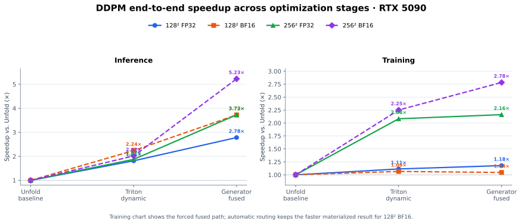

# Dynamic Convolution Operator

这是 ECCV 2020 HD²F-Net 中 Dynamic Dilated Pyramid Module（DDPM）的优化实现。
`unfold_impl.py` 是数学参考，`triton_impl.py` 是 CPU/CUDA 自适应实现，
`_triton_kernels.py` 包含 Triton kernel。

## 问题与目标

参考实现会同时产生两个大中间量：

1. 三个 `Unfold(x)`：约 `3 * N * C * K² * H * W`；
2. 1×1 生成器输出的动态核：`N * 3 * C * K² * H * W`。

这既增加显存流量，也让训练保存动态核及其梯度。优化实现借鉴
FlashAttention/NATTEN 的 producer-consumer 融合、反向重计算和分块归约，但保留普通动态
depthwise 卷积的数学定义，不引入 neighborhood attention 的特殊语义。

## 实现设计

### CUDA 动态过滤

已生成动态核时，单个 Triton kernel 同时处理 dilation `(1, 3, 5)`，不再执行 `Unfold`。
前向按空间 tile 读取邻域，FP32 累加后直接写出 `[x, d1, d3, d5]`。反向分别融合 `dX`
和 `dK`，避免构造补丁矩阵。tile 和 warp 数按 `(C,H,W,K)` 首次自动调优。

### CUDA 融合生成器推理

无梯度、未开启 autocast 且输入与参数 dtype 相同时，1×1 kernel 生成器和动态过滤在同一
`channel tile × spatial tile` 中完成：

```text
y tile -> tl.dot(weight, y) -> dynamic taps -> consume with shifted x -> output
```

动态核只存在于寄存器/片上临时值中，不写入全局显存。最后的 3×3 `fuse` 卷积继续交给
cuDNN；将其并入前一个 kernel 会让动态过滤结果在输出通道 tile 间重复计算，得不偿失。

### CUDA Flash 式融合训练

`K<=3` 时提供不保存 `K`、不构造 `dK` 的自定义 autograd：

- forward：与融合推理相同，生成后立即消费；
- `dX`：反向重算动态 tap，并 gather 各 dilation 的贡献；
- `dY`：片上形成 `dK = shifted(x) * grad`，立即与生成器权重相乘；
- `dWeight/dbias`：片上形成 `dK`，执行空间归约。小尺寸直接写回；大尺寸把 token 切成
  最多 16 个 FP32 partial，再用第二个短 kernel 归约。这解决了单 CTA 串行扫描全部像素的
  扩展瓶颈，只需数 MiB workspace，而不是数百 MiB 动态核。

FP32 前向使用 IEEE dot，以守住推理误差阈值；FP32 大尺寸反向归约和重计算使用 TF32
Tensor Core，所有归约保持 FP32 accumulator。BF16 在写出动态 tap 前显式量化，匹配
PyTorch 生成器的 dtype 语义。

`fused_generator_training=None` 是默认自动模式：

- 空间 token `N*H*W > 16384`：融合训练；
- 恰好 `16384`：FP32 融合，BF16 物化；
- 更小尺寸、`K>3`、autocast 或 dtype 不匹配：生成器由 PyTorch/cuDNN 执行，再调用融合
  动态过滤。

可传 `True` 强制低显存融合训练，或传 `False` 强制物化路径。

### CPU 与超大输入

- CPU 常规尺寸：动态核不超过默认 256 MiB 时保留高效 1×1 GEMM；推理用 padding +
  shifted view 代替 `Unfold`，训练使用 oneDNN 友好的路径。
- 超过预算：按空间 token 流式生成/消费；训练可用 checkpoint 重算 tile。临时动态核从
  `O(NHW * 3CK²)` 降为 `O(NT * 3CK²)`，默认 `T=4096`。
- CPU-only 环境无需安装 Triton；CUDA 张量第一次进入模块时才延迟导入。

## 使用

接口与参考实现兼容：

```python
from triton_impl import DDPM

module = DDPM(dim=64, kernel_size=3)
output = module(x, y)
```

完整参数：

```python
module = DDPM(
    dim=64,
    kernel_size=3,
    spatial_tile_size=4096,
    max_generated_bytes=256 * 1024**2,
    recompute=True,
    fused_generator_inference=True,
    fused_generator_training=None,  # None=自动，True=强制融合，False=物化
)
```

## 验证与基准

CPU（`ptcoding`）：

```powershell
conda run -n ptcoding python -m unittest -v test_triton_impl.py
conda run -n ptcoding python bench.py --device cpu --dim 32 --resolution 48 --warmup 3 --repeats 20
conda run -n ptcoding python bench.py --device cpu --dim 32 --resolution 32 --backward
```

GPU：

```bash
python gpu_validate.py
python gpu_bench.py --quick --training --warmup 20 --repeats 100
python gpu_bench.py --only-r256 --training --warmup 15 --repeats 50
python gpu_memory_bench.py --implementation fused --dtype float32 --resolution 256
python plot_performance.py
```

GPU 回归覆盖：

- `K=1/3/5`；
- `B=2, C=24, H=15, W=17`，覆盖非 2 次幂通道、mask、非方形边界和跨 tile 邻域；
- 显式 FP32/BF16 融合训练；
- 输出、`x/y` 梯度、generator/fuse 全部参数梯度；
- 物化 Triton、融合 Triton 与 Unfold 三路比较。

最终验证环境为 RTX 5090、PyTorch `2.8.0+cu128`、CUDA 12.8、Triton 3.4.0。
完整矩阵开始时 GPU 为 `0%`、`0 MiB`。所有正确性检查通过。`K=3` FP32 融合训练在
`C=24` 非对齐回归中的输出最大绝对误差为 `9.43e-5`；BF16 为 `1.5625e-2`。

## RTX 5090 结果

以下为热身后的 CUDA event 稳态结果，主要尺寸是 `B=1, C=64, K=3`。横轴依次表示
Unfold 基线、仅替换动态过滤，以及进一步融合 generator；纵轴是相对 Unfold 的端到端
加速比。训练面板展示强制融合路径，128² BF16 的默认自动模式会选择更快的物化结果。



动态过滤前向在 128² FP32/BF16 下分别达到 3.79×/5.03×，保守有效带宽下界为
1.766/1.790 TB/s，已接近该卡的显存带宽上界；256² 下分别达到 4.72×/5.78×。
`K=5, 128²` 的动态过滤加速为 FP32 4.74×、BF16 3.60×。

完整推理在 128² 达到 FP32 2.78×、BF16 3.72×，在 256² 达到 FP32 3.73×、
BF16 5.23×。FP32 128² 最大绝对误差为 `1.894e-3`、RMSE `3.260e-4`；
BF16 最大绝对误差为 `2.344e-2`、RMSE `3.729e-3`。`K=5, 128²` 完整推理另测为
FP32 4.13×、BF16 4.42×。

完整训练的默认自动路径在 128² 达到 FP32 1.18×、BF16 1.06×，在 256² 达到
FP32 2.16×、BF16 2.78×。大尺寸融合相对物化 Triton 再快 3.9%（FP32）和
23.6%（BF16）；剩余时间主要属于最后的 cuDNN 3×3 卷积及其反向。

隔离进程测得，强制融合训练相对 Unfold 的临时峰值显存减少 72.6%～81.5%，相对物化
Triton 减少 64.3%～75.8%。其中 256² FP32 从 1232.6 MiB 降至 326.8 MiB，
256² BF16 从 616.3 MiB 降至 114.3 MiB。

## 已验证但未采用的方案

- 扩大融合生成器 autotune 搜索到 `BLOCK_C=16/32 × BLOCK_HW=64/128`：大尺寸配置未胜出，
  会显著增加首次编译时间。
- `torch.compile(mode="reduce-overhead")`：独立动态训练反而变慢；整个模块最多约 1.12×，
  不适合作为默认路径。
- `tf32x3`：精度通过，但在 RTX 5090/Triton 3.4 上没有速度收益。
- 前向原生 TF32：R256 推理可到约 0.598 ms，但最大误差 `4.04e-3` 超过既定
  `2e-3` 阈值，因此只在反向使用 TF32。
- 单 CTA 扫完整个 R256 空间：`dWeight` 单 kernel 达 2.63 ms；split-reduction 将
  R256 FP32 整体融合训练从 6.03 ms 降至 3.66 ms。

首次遇到新 `(C,H,W,K,dtype)` 会产生 Triton JIT/autotune 冷启动；表中不包含编译时间。
性能数字依赖 GPU、dtype、shape 和 cuDNN 算法，应在目标模型上复测。

## BibTeX

```bibtex
@inproceedings{HDFNet-ECCV2020,
    author = {Youwei Pang and Lihe Zhang and Xiaoqi Zhao and Huchuan Lu},
    title = {Hierarchical Dynamic Filtering Network for RGB-D Salient Object Detection},
    booktitle = ECCV,
    year = {2020}
}
```
